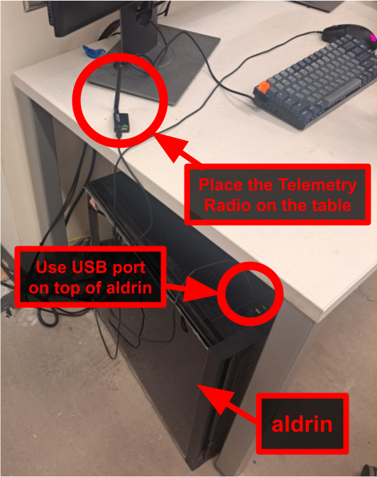
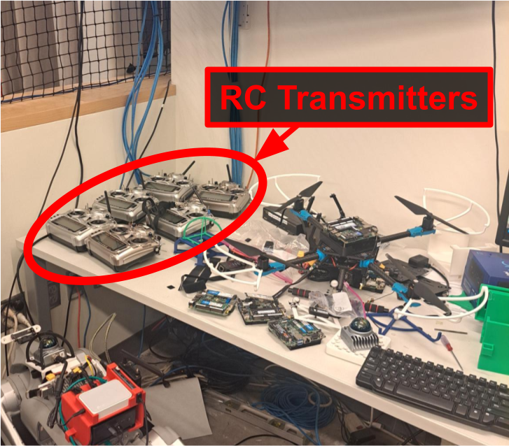

# Flight

## Step 1: Move Drone to Flight Space

1. Place drone in the flight space on a table. **DO NOT POWER ON YET.**
2. Initial Safety Check:
   - (i) Ensure the net is sufficiently taut,
   - (ii) Ensure there is sufficient takeoff / landing space on the table, and
   - (iii) Ensure the takeoff / landing space is free of Foreign Object Debris (FOD), including zip ties, tools, spare batteries, etc.

Note: FOD can get pulled into the props during takeoff / liftoff thus pose a serious safety concern!

## Step 2: Mocap

1. Flip the mocap power strip switch.
   
2. Configure mocap software on `AMSTRONG`.
   

## 3. Setup `aldrin`

1. Login to `aldrin` as `mit-1685`.
2. Connect the correct telemetry radio for your drone (e.g., `BD03`) into a free USB port on `aldrin`. The telemetry radios are stored in the rolling cabinet next to `AMSTRONG`. Only one telemetry radio should be connected to `aldrin` at a time.
   
   
   
3. Open terminals on `aldrin` and run the following commands:
   ```
   # terminal 1
   # runs QGroundControl
   # helpful for situational awareness and debugging
   qgc

   # terminal 2
   # bridge for ROS2 Data Distribution Service (DDS)
   zenoh

   # terminal 3
   # runs ROS2 mocap code
   mocap
   ```
   See some terminal tips [here](./terminal.md).

## 4. Power on Drone

1. Attach a LiPo battery beeper to the `4S` and `6S` battery you will use to power the drone. Ensure the battery voltages are within expected ranges.

| LiPo Cells | Min Voltage | Max Voltage |
| - | - | - |
| 1S | 3.7V | 4.2V |
| 3S | 11.1V | 12.6V |
| 4S | 14.8V | 16.8V |
| 6S | 22.2V | 25.2V |

References: [[1]](https://en.wikipedia.org/wiki/Lithium_polymer_battery#Voltage_and_state_of_charge) [[2]](https://www.competitionx.com/beginners-guide-to-rc/understanding-lipo-battery-voltage/)


**Caution:** For battery health and safety, **NEVER** let LiPo batteries get to 3.2-3.3V. If a battery gets into (or below) this voltage range, it needs be properly disposed of. Handle with care!

2. Attach the batteries to the drone in the correct configuration: the `4S` battery's female XT60 connector should align with the electronics' male XT60 connector, and the `6S` battery's female XT60 connector should align with the drone power distribution board's male XT60 connector. Confirm velcro is snug.

3. Connect the `4S` battery to electronics (e.g., the computer). Press the power button on the Intel NUC to power on the CPU (the power button should glow indicating it is on).
   - If you're not sure XT60 connector is the electronics (as opposed to the drone), ask -- a mistake here can damage expensive equipment!
4. Confirm the flight space is free of unnecessary personnel. For safety, loudly announce you are powering on the drone to ensure everyone is aware.
5. Connect the `6S` battery to the drone's power distribution board.
   - It is fine to power the electronics (e.g., the computer) outside the flight space. However, the drone's power distribution board - and therefore its **props and motors** - should **NEVER** be powered outside the designated flight area. Even with safeguards to prevent unintentional spinning, powered motors must always be treated as if they could start at any moment.
6. Ensure battery velcro straps are still snug after connecting power. Batteries falling off the drone in flight means a drone crash!
7. Seal the flight nets, confirm all personnel have left the flight space, and seal the control room net.

## 5. Power on RC Transmitter

1. Fetch the correct FrSky Taranis X9D (e.g. `PX04`).
   
2. An operator needs to be wearing the lanyard the entire time the controller is powered on. For safety, removing the lanyard means powering off the controller.
   
3. Review the [RC Transmitter switch documentation](./rc-transmitter.md). Visually confirm the kill switch is denoted with tape or some other distinct marking.
4. Confirm the switches are in the correct positions:

| Purpose | Switch Position | Description |
| - | - | - |
| **Throttle Off** | J3 down | left stick pulled all towards pilot |
| **Disarmmed** | SF down | bottom left shoulder button towards floor|
| **Land Mode**  | SA down | upper left face switch towards pilot |
| **Kill Switch Enabled** | SD down | upper right face switch (marked with tape) towards pilot |


5. Power on the controller. Click through alerts. On the display, confirrm battery is above 50% and the profile is set to `cap`.

## 6. Run Drone Code

1. Open another terminal on `aldrin`. Connect to the drone and run the following command with:
   ```
   # terminal 4
   ssh d01
   dynus
   ```
   Note although all terminal windows are running on `aldrin`, terminals 1-3 are running software directly on `aldrin`, while terminal 4 is running software on the drone.
2. Confirm terminal output looks normal:
3. Confirm QGroundControl has reached Green status. This may take a minute.

Technically, you do not need to run QGroundControl, but it does provide some useful diagnostic tools, so we recommend using it.

## 7. Final Safety Check

1. Confirm flight space is clear of personnel.
2. Confirm the flight space and control room nets are secured.
3. Confirm the operator has the correct RC transmitter, it is powered on, in the right mode, and they are wearing the lanyard.
4. Confirm the RC transmitter switches are in the correct configuration.
5. Confirm no batteries are beeping.
6. Confirm all computer readouts look good.
7. Loudly announce to the flight space: "Taking off!"

## 8. Flying

1. Undo the Kill Switch
   - Move SD up (away from pilot)
2. Switch to desired flight mode
   - Move SA up for `position mode` (flying with joysticks)
   - Move SA middle for `offboard mode` (flying via autonomy code)
3. Arm the drone
   - Move SF up
4. Gently ease up on the throttle to take off. The drone may disarm automatically if no change in throttle is detected after a few seconds. Recommend starting over from 1.
5. Make sure to be hovering (i.e., not climbing or descending) before moving in the `xy`-plane.
6. Perform your flight, remembering to be gentle while getting your bearings.

## 9. Landing

1. Navigate to above the desired landing location.
2. Gently ease up on the throttle to land.
3. Once you touch down, move the following switches:
   - **Throttle Down:** left stick (J3) down
   - **Disarmmed:** SF down
   - **Land Mode:** SA down
   - **Kill Switch Enabled:** SD down
4. Once the Kill switch is thrown, you can terminate any software and disconnect any batteries. Always disconnect the 6S battery first to ensure the motors are depowered as soon as possible.

## 10. Cleanup

- Close all applications on `aldrin`, back up any data files you may need, and log off.
(Note: `aldrin` is a shared computer. Once you log off, there is no guarantee that any programs you left running or files stored locally will remain as you left them.)
- Return batteries to the appropriate charge / discharge bins. Remove beepers and return to bag. If possible, charge the batteries used to replace what you used.
- Return drone, RC transmitter, and telemetry radio to original location
- Turn off mocap

## Checklist
Refer to abridged checklist [here](./flight-checklist.md).