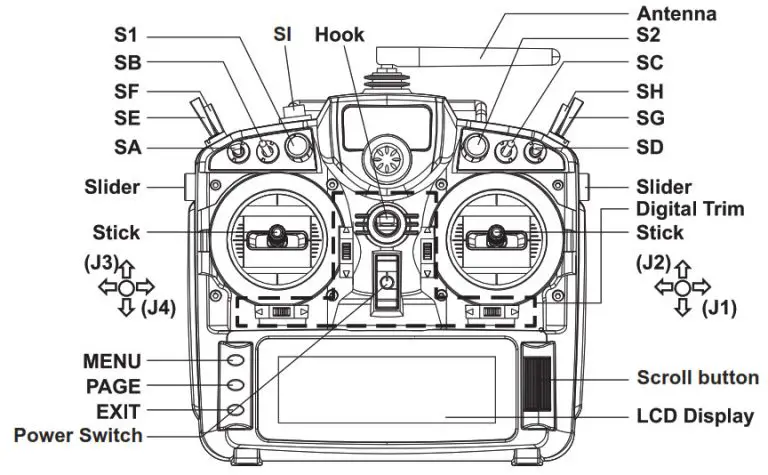

# RC Transmitter

[Image Source](https://device.report/manual/342515)

## J1
| Position | Command |
| - | - |
| Left | Move Y+ |
| Right | Move Y- |

## J2
| Position | Command |
| - | - |
| Up | Move X+ |
| Down | Move X- |

## J3
| Position | Command |
| - | - |
| Up | Throttle Max |
| Down | Throttle Off |

## J4
| Position | Command |
| - | - |
| Left | Yaw CCW |
| Right | Yaw CW |

## SA
| Position | Command |
| - | - |
| Up | Position Mode |
| Center | Offboard Mode |
| Down | Land Mode |

## SD
| Position | Command |
| - | - |
| Up | Alive |
| Down | Kill |

## SF
| Position | Command |
| - | - |
| Up | Armed |
| Down | Disarmed |